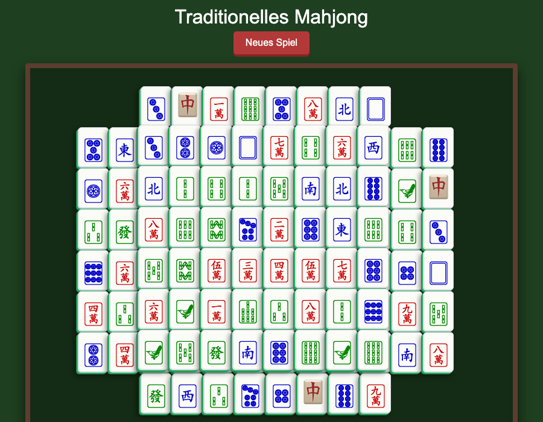

# Traditionelles Mahjong

A classic Mahjong solitaire game playable directly in the browser — no dependencies, no build step, single HTML file.



## How to Play

1. Open `gemini.html` in any modern browser
2. Click **Neues Spiel** to start a new game
3. Select two matching free tiles to remove them
4. A tile is *free* if it is not covered by another tile and has at least one open side (left or right)
5. Clear all 144 tiles to win

## Features

- Traditional 144-tile layout across 4 levels
- Full Unicode Mahjong tile set (winds, dragons, characters, bamboo, circles)
- Color-coded suits (red, green, blue)
- Visual 3-D tile stack effect
- Purely client-side — works offline, no server needed

## Run Locally

```bash
open gemini.html        # macOS
xdg-open gemini.html   # Linux
start gemini.html       # Windows
```
